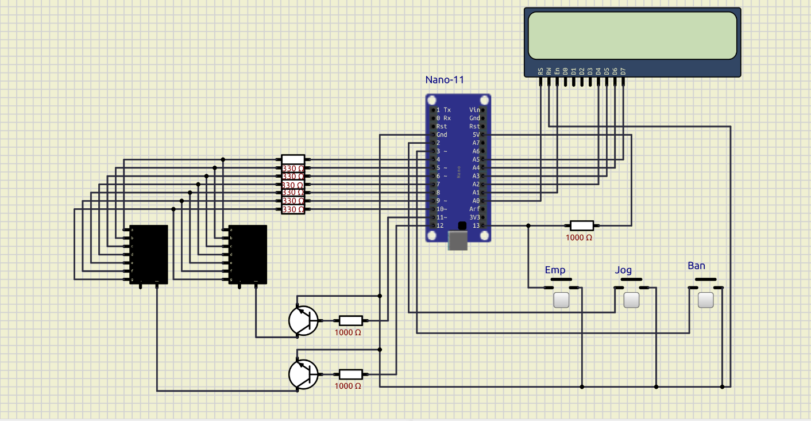
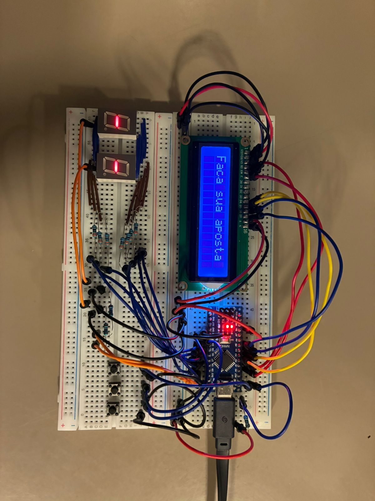

# Documentação - Projeto Bacará

Este documento detalha o esquemático elétrico, as decisões de montagem do circuito físico e virtual (SimulIDE), e a implementação das rotinas de interrupção (ISRs) para a execução do jogo Bacará utilizando o microcontrolador ATmega328P. O circuito foi projetado para espelhar exatamente a montagem na protoboard física, garantindo que o código em Assembly opere de forma idêntica em ambos os ambientes.

## Parte I: Especificação do Hardware

### 1. Componentes Utilizados

* 1x Placa Arduino Nano (ATmega328P)
* 2x Displays de 7 Segmentos (Cátodo Comum)
* 2x Transistores NPN (BC548 ou equivalente)
* 1x Display LCD 16x2
* 3x Chaves Tácteis (Push buttons)
* 7x Resistores de 330 Ω (para os segmentos do display)
* 3x Resistores de 1 kΩ (2 para a base dos transistores, 1 para pull-up externo)

### 2. Mapeamento de Pinos

A tabela abaixo descreve a alocação de portas digitais e analógicas do ATmega328P para os periféricos do sistema.

| Componente | Pino Arduino | Função Específica | 
| :--- | :--- | :--- | 
| **Botões** | D2 | Aposta: Jogador (Interrupção INT0) | 
| | D3 | Aposta: Banca (Interrupção INT1) | 
| | D13 | Aposta: Empate (Interrupção PCINT5) | 
| **Barramento 7 Seg.** | D4 ao D10 | Controle dos segmentos A até G, respectivamente. | 
| **Multiplexação** | D11 | Chaveamento do display da Banca (Transistor Direito) | 
| | D12 | Chaveamento do display do Jogador (Transistor Esquerdo) | 
| **Display LCD** | A0 | Pino RS do LCD | 
| | A1 | Pino Enable (E) do LCD | 
| | A2 ao A5 | Pinos de dados D4, D5, D6 e D7 do LCD | 

### 3. Detalhamento das Ligações

#### 3.1. Botões, Pull-up Interno e Externo

Os três botões foram aterrados na mesma linha de GND do circuito, operando com lógica invertida (pressionar gera nível baixo). No entanto, há uma diferença no modo como o estado lógico alto é garantido:

* **Jogador (D2) e Banca (D3):** Conectados diretamente, sem resistores físicos externos. O estado alto é mantido via software pela ativação dos resistores de *pull-up* internos do ATmega328P.
* **Empate (D13):** Utiliza um **resistor de pull-up externo de 1 kΩ** conectado à linha de 5V. Como a placa Arduino Nano possui um LED *onboard* integrado diretamente ao pino D13 (que drena corrente para a terra), o *pull-up* interno do microcontrolador é insuficiente para garantir um nível lógico alto estável. O resistor externo contorna essa limitação física da placa.

#### 3.2. Displays de 7 Segmentos e Varredura

Para economizar portas digitais, os dois displays de 7 segmentos compartilham o mesmo barramento de dados. Os pinos A a G do display do Jogador estão ligados em paralelo aos pinos A a G do display da Banca, protegidos por uma única barreira de resistores de 330 Ω ligada entre os pinos D4 e D10.

O controle de acionamento é feito por dois transistores NPN operando como chaves no lado de baixo (aterramento). A corrente sai do pino comum (cátodo) de cada display e entra no coletor do transistor. Quando os pinos D11 ou D12 enviam nível lógico alto para a base (protegida por resistores de 1 kΩ), o transistor satura e escoa a corrente para o GND, acendendo o display selecionado naquele ciclo de varredura.

#### 3.3. Interface do LCD (Alteração de Projeto)

Inicialmente planejado para operar via protocolo I2C (módulo PCF8574), o diagrama final consolidou a conexão do display LCD 16x2 de forma direta no modo de 4 bits. Os pinos de controle (RS e Enable) e o barramento de dados (D4-D7) foram mapeados para as portas A0 a A5 do Arduino. Como essas portas analógicas também operam perfeitamente como GPIOs (saídas digitais), essa configuração remove a necessidade do módulo I2C adicional, simplifica a fiação na protoboard física e elimina potenciais conflitos de temporização no barramento durante a ocorrência das interrupções do jogo. O pino RW do LCD foi permanentemente aterrado, já que o sistema fará apenas operações de escrita na tela.

### 4. Diagrama Virtual e Circuito Físico

O espelhamento entre o ambiente de simulação e a montagem física garante a previsibilidade do código em Assembly. Abaixo, apresentamos o diagrama lógico desenvolvido no SimulIDE e a sua correspondente implementação em hardware.

**Diagrama no SimulIDE:**

**Circuito Físico Montado na Protoboard:**

---

## Parte II: Documentação de Software — `interruptions.S`
